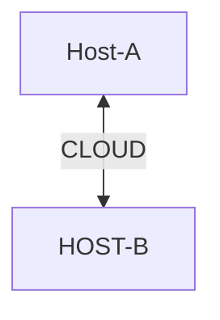

# DNS

### Introduction



```mermaid
graph TD;
    Host-A<--CLOUD-->HOST-B;
```


```
$ ping db
ping: unknown host db 
```


```
$ cat >> /etc/hosts
192.168.1.11    db
```

```
$ ping db
```

Now the ping db command will work


