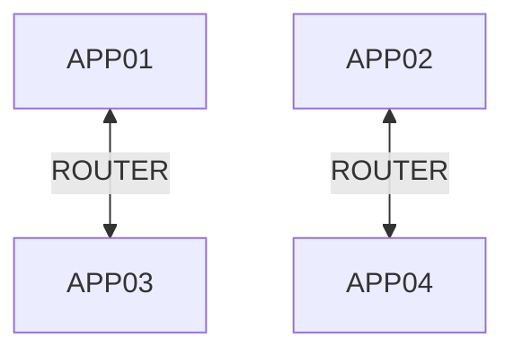
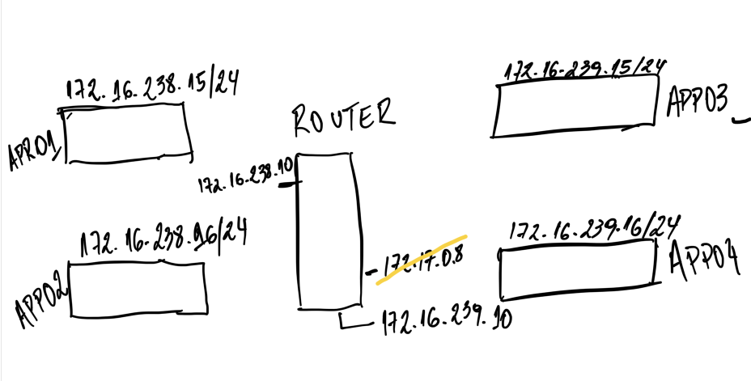

# Switching and Routing


## Network Diagram





### Detailed network diagram 




## ROUTER IPs previously

We can notice the router has previously only IP 172.16.238.10/24 in eth0

```
thor@jump_host ~$ ip a
1: lo: <LOOPBACK,UP,LOWER_UP> mtu 65536 qdisc noqueue state UNKNOWN group default qlen 1000
    link/loopback 00:00:00:00:00:00 brd 00:00:00:00:00:00
    inet 127.0.0.1/8 scope host lo
       valid_lft forever preferred_lft forever
11: eth0@if12: <BROADCAST,MULTICAST,UP,LOWER_UP> mtu 1500 qdisc noqueue state UP group default 
    link/ether 02:42:ac:10:ee:0a brd ff:ff:ff:ff:ff:ff link-netnsid 0
    inet 172.16.238.10/24 brd 172.16.238.255 scope global eth0
       valid_lft forever preferred_lft forever
27: eth1@if28: <BROADCAST,MULTICAST,UP,LOWER_UP> mtu 1500 qdisc noqueue state UP group default 
    link/ether 02:42:ac:11:00:07 brd ff:ff:ff:ff:ff:ff link-netnsid 0
    inet 172.17.0.7/16 brd 172.17.255.255 scope global eth1
       valid_lft forever preferred_lft forever
```


## Configuring app01 IP address 172.16.238.15/24

```
thor@jump_host ~$ ssh app01
Last login: Fri Jul 28 19:29:43 2023 from jump_host.devops-networking-switching_app_net
```


```
[thor@app01 ~]$ ip a
1: lo: <LOOPBACK,UP,LOWER_UP> mtu 65536 qdisc noqueue state UNKNOWN group default qlen 1000
    link/loopback 00:00:00:00:00:00 brd 00:00:00:00:00:00
    inet 127.0.0.1/8 scope host lo
       valid_lft forever preferred_lft forever
15: eth0@if16: <BROADCAST,MULTICAST,UP,LOWER_UP> mtu 1500 qdisc noqueue state UP group default 
    link/ether 02:42:ac:10:ee:0b brd ff:ff:ff:ff:ff:ff link-netnsid 0
    inet 172.16.238.11/24 brd 172.16.238.255 scope global eth0
       valid_lft forever preferred_lft forever
23: eth1@if24: <BROADCAST,MULTICAST,UP,LOWER_UP> mtu 1500 qdisc noqueue state UP group default 
    link/ether 02:42:ac:11:00:05 brd ff:ff:ff:ff:ff:ff link-netnsid 0
    inet 172.17.0.5/16 brd 172.17.255.255 scope global eth1
       valid_lft forever preferred_lft forever


[thor@app01 ~]$ sudo ip addr add 172.16.238.15/24 dev eth0
[thor@app01 ~]$


[thor@app01 ~]$ ip a
1: lo: <LOOPBACK,UP,LOWER_UP> mtu 65536 qdisc noqueue state UNKNOWN group default qlen 1000
    link/loopback 00:00:00:00:00:00 brd 00:00:00:00:00:00
    inet 127.0.0.1/8 scope host lo
       valid_lft forever preferred_lft forever
15: eth0@if16: <BROADCAST,MULTICAST,UP,LOWER_UP> mtu 1500 qdisc noqueue state UP group default 
    link/ether 02:42:ac:10:ee:0b brd ff:ff:ff:ff:ff:ff link-netnsid 0
    inet 172.16.238.11/24 brd 172.16.238.255 scope global eth0
       valid_lft forever preferred_lft forever
    inet 172.16.238.15/24 scope global secondary eth0
       valid_lft forever preferred_lft forever
23: eth1@if24: <BROADCAST,MULTICAST,UP,LOWER_UP> mtu 1500 qdisc noqueue state UP group default 
    link/ether 02:42:ac:11:00:05 brd ff:ff:ff:ff:ff:ff link-netnsid 0
    inet 172.17.0.5/16 brd 172.17.255.255 scope global eth1
       valid_lft forever preferred_lft forever
```


Notice the new IP 172.16.238.15/24 


### Removing previously address 172.16.238.11/24

```
[thor@app01 ~]$ sudo ip addr del 172.16.238.11/24 dev eth0
```


## Configuring app02 IP address 172.16.238.16/24

```
thor@jump_host ~$ ssh app02
The authenticity of host 'app02 (172.16.238.12)' can't be established.
ECDSA key fingerprint is SHA256:CMPXAUss5JKSahNrNstkQ9PwylVS6PFfqdcPss+AbjY.
ECDSA key fingerprint is MD5:c1:98:7c:c2:ac:eb:1e:25:5a:03:65:52:55:aa:85:02.
Are you sure you want to continue connecting (yes/no)? yes
Warning: Permanently added 'app02,172.16.238.12' (ECDSA) to the list of known hosts.


[thor@app02 ~]$ ip a
1: lo: <LOOPBACK,UP,LOWER_UP> mtu 65536 qdisc noqueue state UNKNOWN group default qlen 1000
    link/loopback 00:00:00:00:00:00 brd 00:00:00:00:00:00
    inet 127.0.0.1/8 scope host lo
       valid_lft forever preferred_lft forever
17: eth0@if18: <BROADCAST,MULTICAST,UP,LOWER_UP> mtu 1500 qdisc noqueue state UP group default 
    link/ether 02:42:ac:10:ee:0c brd ff:ff:ff:ff:ff:ff link-netnsid 0
    inet 172.16.238.12/24 brd 172.16.238.255 scope global eth0
       valid_lft forever preferred_lft forever
21: eth1@if22: <BROADCAST,MULTICAST,UP,LOWER_UP> mtu 1500 qdisc noqueue state UP group default 
    link/ether 02:42:ac:11:00:04 brd ff:ff:ff:ff:ff:ff link-netnsid 0
    inet 172.17.0.4/16 brd 172.17.255.255 scope global eth1
       valid_lft forever preferred_lft forever


[thor@app02 ~]$ sudo ip addr add 172.16.238.16/24 dev eth0
[thor@app02 ~]$ 


[thor@app02 ~]$ ip a
1: lo: <LOOPBACK,UP,LOWER_UP> mtu 65536 qdisc noqueue state UNKNOWN group default qlen 1000
    link/loopback 00:00:00:00:00:00 brd 00:00:00:00:00:00
    inet 127.0.0.1/8 scope host lo
       valid_lft forever preferred_lft forever
17: eth0@if18: <BROADCAST,MULTICAST,UP,LOWER_UP> mtu 1500 qdisc noqueue state UP group default 
    link/ether 02:42:ac:10:ee:0c brd ff:ff:ff:ff:ff:ff link-netnsid 0
    inet 172.16.238.12/24 brd 172.16.238.255 scope global eth0
       valid_lft forever preferred_lft forever
    inet 172.16.238.16/24 scope global secondary eth0
       valid_lft forever preferred_lft forever
21: eth1@if22: <BROADCAST,MULTICAST,UP,LOWER_UP> mtu 1500 qdisc noqueue state UP group default 
    link/ether 02:42:ac:11:00:04 brd ff:ff:ff:ff:ff:ff link-netnsid 0
    inet 172.17.0.4/16 brd 172.17.255.255 scope global eth1
       valid_lft forever preferred_lft forever
```


### Removing previously address 172.16.238.12/24


```
[thor@app02 ~]$ sudo ip addr del 172.16.238.12/24 dev eth0
```


## Configuring app03 IP address 172.16.239.15/24 

```
thor@jump_host ~$ ssh app03
The authenticity of host 'app03 (172.16.238.13)' can't be established.
ECDSA key fingerprint is SHA256:lMJEs1ARTbC5Ev4HW2/Km0KCwHJHmJ84HyGHny/gmJI.
ECDSA key fingerprint is MD5:af:aa:2e:89:eb:5b:71:39:25:68:7c:ac:aa:11:f8:a0.
Are you sure you want to continue connecting (yes/no)? yes
Warning: Permanently added 'app03,172.16.238.13' (ECDSA) to the list of known hosts.


[thor@app03 ~]$ ip a
1: lo: <LOOPBACK,UP,LOWER_UP> mtu 65536 qdisc noqueue state UNKNOWN group default qlen 1000
    link/loopback 00:00:00:00:00:00 brd 00:00:00:00:00:00
    inet 127.0.0.1/8 scope host lo
       valid_lft forever preferred_lft forever
9: eth0@if10: <BROADCAST,MULTICAST,UP,LOWER_UP> mtu 1500 qdisc noqueue state UP group default 
    link/ether 02:42:ac:10:ee:0d brd ff:ff:ff:ff:ff:ff link-netnsid 0
    inet 172.16.238.13/24 brd 172.16.238.255 scope global eth0
       valid_lft forever preferred_lft forever
25: eth1@if26: <BROADCAST,MULTICAST,UP,LOWER_UP> mtu 1500 qdisc noqueue state UP group default 
    link/ether 02:42:ac:11:00:06 brd ff:ff:ff:ff:ff:ff link-netnsid 0
    inet 172.17.0.6/16 brd 172.17.255.255 scope global eth1
       valid_lft forever preferred_lft forever

[thor@app03 ~]$ sudo ip addr add 172.16.239.15/24 dev eth0

[thor@app03 ~]$ ip a
1: lo: <LOOPBACK,UP,LOWER_UP> mtu 65536 qdisc noqueue state UNKNOWN group default qlen 1000
    link/loopback 00:00:00:00:00:00 brd 00:00:00:00:00:00
    inet 127.0.0.1/8 scope host lo
       valid_lft forever preferred_lft forever
9: eth0@if10: <BROADCAST,MULTICAST,UP,LOWER_UP> mtu 1500 qdisc noqueue state UP group default 
    link/ether 02:42:ac:10:ee:0d brd ff:ff:ff:ff:ff:ff link-netnsid 0
    inet 172.16.238.13/24 brd 172.16.238.255 scope global eth0
       valid_lft forever preferred_lft forever
    inet 172.16.239.15/24 scope global eth0
       valid_lft forever preferred_lft forever
25: eth1@if26: <BROADCAST,MULTICAST,UP,LOWER_UP> mtu 1500 qdisc noqueue state UP group default 
    link/ether 02:42:ac:11:00:06 brd ff:ff:ff:ff:ff:ff link-netnsid 0
    inet 172.17.0.6/16 brd 172.17.255.255 scope global eth1
       valid_lft forever preferred_lft forever
[thor@app03 ~]$ 
```


### Removing previously address 172.16.238.13/24


```
[thor@app03 ~]$ sudo ip addr del 172.16.238.13/24 dev eth0
```


## Configuring app03 IP address 172.16.239.16/24 

```
thor@jump_host ~$ ssh app04
The authenticity of host 'app04 (172.16.238.14)' can't be established.
ECDSA key fingerprint is SHA256:NuEJ9oUydR6/pqlQCNqkpd6oKk7O9H8QPhNqtcxRXvA.
ECDSA key fingerprint is MD5:f7:30:8b:df:46:a9:60:5b:0a:ed:2f:ec:2a:75:81:f7.
Are you sure you want to continue connecting (yes/no)? yes
Warning: Permanently added 'app04,172.16.238.14' (ECDSA) to the list of known hosts.
[thor@app04 ~]$ ip a
1: lo: <LOOPBACK,UP,LOWER_UP> mtu 65536 qdisc noqueue state UNKNOWN group default qlen 1000
    link/loopback 00:00:00:00:00:00 brd 00:00:00:00:00:00
    inet 127.0.0.1/8 scope host lo
       valid_lft forever preferred_lft forever
13: eth0@if14: <BROADCAST,MULTICAST,UP,LOWER_UP> mtu 1500 qdisc noqueue state UP group default 
    link/ether 02:42:ac:10:ee:0e brd ff:ff:ff:ff:ff:ff link-netnsid 0
    inet 172.16.238.14/24 brd 172.16.238.255 scope global eth0
       valid_lft forever preferred_lft forever
29: eth1@if30: <BROADCAST,MULTICAST,UP,LOWER_UP> mtu 1500 qdisc noqueue state UP group default 
    link/ether 02:42:ac:11:00:08 brd ff:ff:ff:ff:ff:ff link-netnsid 0
    inet 172.17.0.8/16 brd 172.17.255.255 scope global eth1
       valid_lft forever preferred_lft forever
[thor@app04 ~]$ sudo ip addr add 172.16.239.16/24 dev eth0
[thor@app04 ~]$ ip a
1: lo: <LOOPBACK,UP,LOWER_UP> mtu 65536 qdisc noqueue state UNKNOWN group default qlen 1000
    link/loopback 00:00:00:00:00:00 brd 00:00:00:00:00:00
    inet 127.0.0.1/8 scope host lo
       valid_lft forever preferred_lft forever
13: eth0@if14: <BROADCAST,MULTICAST,UP,LOWER_UP> mtu 1500 qdisc noqueue state UP group default 
    link/ether 02:42:ac:10:ee:0e brd ff:ff:ff:ff:ff:ff link-netnsid 0
    inet 172.16.238.14/24 brd 172.16.238.255 scope global eth0
       valid_lft forever preferred_lft forever
    inet 172.16.239.16/24 scope global eth0
       valid_lft forever preferred_lft forever
29: eth1@if30: <BROADCAST,MULTICAST,UP,LOWER_UP> mtu 1500 qdisc noqueue state UP group default 
    link/ether 02:42:ac:11:00:08 brd ff:ff:ff:ff:ff:ff link-netnsid 0
    inet 172.17.0.8/16 brd 172.17.255.255 scope global eth1
       valid_lft forever preferred_lft forever
```


### Removing previously address 172.16.238.14/24


```
[thor@app04 ~]$ sudo ip addr del 172.16.238.14/24 dev eth0
```


## Adding new IP address 172.16.239.10/24  in jump_host to access app03 and app04


```
thor@jump_host ~$ ip a
1: lo: <LOOPBACK,UP,LOWER_UP> mtu 65536 qdisc noqueue state UNKNOWN group default qlen 1000
    link/loopback 00:00:00:00:00:00 brd 00:00:00:00:00:00
    inet 127.0.0.1/8 scope host lo
       valid_lft forever preferred_lft forever
11: eth0@if12: <BROADCAST,MULTICAST,UP,LOWER_UP> mtu 1500 qdisc noqueue state UP group default 
    link/ether 02:42:ac:10:ee:0a brd ff:ff:ff:ff:ff:ff link-netnsid 0
    inet 172.16.238.10/24 brd 172.16.238.255 scope global eth0
       valid_lft forever preferred_lft forever
27: eth1@if28: <BROADCAST,MULTICAST,UP,LOWER_UP> mtu 1500 qdisc noqueue state UP group default 
    link/ether 02:42:ac:11:00:07 brd ff:ff:ff:ff:ff:ff link-netnsid 0
    inet 172.17.0.7/16 brd 172.17.255.255 scope global eth1
       valid_lft forever preferred_lft forever


thor@jump_host ~$ sudo ip addr add 172.16.239.10/24 dev eth0
thor@jump_host ~$ ip a
1: lo: <LOOPBACK,UP,LOWER_UP> mtu 65536 qdisc noqueue state UNKNOWN group default qlen 1000
    link/loopback 00:00:00:00:00:00 brd 00:00:00:00:00:00
    inet 127.0.0.1/8 scope host lo
       valid_lft forever preferred_lft forever
11: eth0@if12: <BROADCAST,MULTICAST,UP,LOWER_UP> mtu 1500 qdisc noqueue state UP group default 
    link/ether 02:42:ac:10:ee:0a brd ff:ff:ff:ff:ff:ff link-netnsid 0
    inet 172.16.238.10/24 brd 172.16.238.255 scope global eth0
       valid_lft forever preferred_lft forever
    inet 172.16.239.10/24 scope global eth0
       valid_lft forever preferred_lft forever
27: eth1@if28: <BROADCAST,MULTICAST,UP,LOWER_UP> mtu 1500 qdisc noqueue state UP group default 
    link/ether 02:42:ac:11:00:07 brd ff:ff:ff:ff:ff:ff link-netnsid 0
    inet 172.17.0.7/16 brd 172.17.255.255 scope global eth1
       valid_lft forever preferred_lft forever
```


### To allow app01 to reach app03 and app04

```
[thor@app01 ~]$ sudo ip route add 172.16.239.0/24 via 172.16.238.10
[thor@app01 ~]$ 
```


### To allow app02 to reach app03 and app04

```
[thor@app02 ~]$ sudo ip route add 172.16.239.0/24 via 172.16.238.10

[thor@app02 ~]$ ip r
172.16.238.0/24 dev eth0 proto kernel scope link src 172.16.238.16 
172.16.239.0/24 via 172.16.238.10 dev eth0 
172.17.0.0/16 dev eth1 proto kernel scope link src 172.17.0.4 
```


### To allow app03 and app04 to reach app01 and app02

```
[thor@app03 ~]$ sudo ip route add 172.16.238.0/24 via 172.16.239.10 
[thor@app03 ~]$ 
[thor@app03 ~]$ ip r
172.16.238.0/24 via 172.16.239.10 dev eth0 
172.16.239.0/24 dev eth0 proto kernel scope link src 172.16.239.15 
172.17.0.0/16 dev eth1 proto kernel scope link src 172.17.0.6 


[thor@app04 ~]$ sudo ip route add 172.16.238.0/24 via 172.16.239.10 
[thor@app04 ~]$ ip r
172.16.238.0/24 via 172.16.239.10 dev eth0 
172.16.239.0/24 dev eth0 proto kernel scope link src 172.16.239.16 
172.17.0.0/16 dev eth1 proto kernel scope link src 172.17.0.8 
```


### Pinging

```
[thor@app01 ~]$ sudo ping app03 -c3
PING app03 (172.16.239.15) 56(84) bytes of data.
64 bytes from app03 (172.16.239.15): icmp_seq=1 ttl=63 time=0.124 ms
64 bytes from app03 (172.16.239.15): icmp_seq=2 ttl=63 time=0.102 ms
64 bytes from app03 (172.16.239.15): icmp_seq=3 ttl=63 time=0.109 ms

--- app03 ping statistics ---
3 packets transmitted, 3 received, 0% packet loss, time 2033ms
rtt min/avg/max/mdev = 0.102/0.111/0.124/0.015 ms

[thor@app01 ~]$ sudo ping app04 -c3
PING app04 (172.16.239.16) 56(84) bytes of data.
64 bytes from app04 (172.16.239.16): icmp_seq=1 ttl=63 time=0.126 ms
64 bytes from app04 (172.16.239.16): icmp_seq=2 ttl=63 time=0.117 ms
64 bytes from app04 (172.16.239.16): icmp_seq=3 ttl=63 time=0.112 ms

--- app04 ping statistics ---
3 packets transmitted, 3 received, 0% packet loss, time 2032ms
rtt min/avg/max/mdev = 0.112/0.118/0.126/0.010 ms
```


#### Pinging from app03 and app04

```
[thor@app03 ~]$ sudo ping -c3 app01
PING app01 (172.16.238.15) 56(84) bytes of data.
64 bytes from app01 (172.16.238.15): icmp_seq=1 ttl=63 time=0.158 ms
64 bytes from app01 (172.16.238.15): icmp_seq=2 ttl=63 time=0.106 ms
64 bytes from app01 (172.16.238.15): icmp_seq=3 ttl=63 time=0.110 ms

--- app01 ping statistics ---
3 packets transmitted, 3 received, 0% packet loss, time 2046ms
rtt min/avg/max/mdev = 0.106/0.124/0.158/0.026 ms

[thor@app03 ~]$ sudo ping -c3 app02
PING app02 (172.16.238.16) 56(84) bytes of data.
64 bytes from app02 (172.16.238.16): icmp_seq=1 ttl=63 time=0.121 ms
64 bytes from app02 (172.16.238.16): icmp_seq=2 ttl=63 time=0.109 ms
64 bytes from app02 (172.16.238.16): icmp_seq=3 ttl=63 time=0.119 ms

--- app02 ping statistics ---
3 packets transmitted, 3 received, 0% packet loss, time 2058ms
rtt min/avg/max/mdev = 0.109/0.116/0.121/0.010 ms
```


