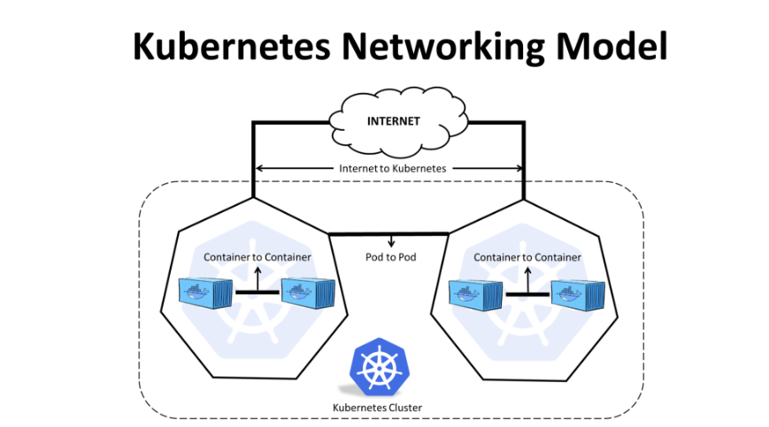

# Kubernetes

## Overview

- Understand container
- Understand orchestration 

### Containers Overview

- We will need a container engine like containerd for example
- Isolate process, Network and mount point
- They all share the same kernel 
- Containers are not virtual machine
- Images are meant to create containers


### Container orchestration 

- We need an orchestration to manage different pods running in different nodes. 
- Kubernetes is one of the orchestration tool availabile today
- We can have also docker swarm and mesos as orchestration 
  


### Kube architecture 

- Nodes or worker nodes
- We need more than one node in our cluster
- We need a control plane, master

#### Main resources in the kubernetes 

- API server
- ETCD
- kubelet
- Container runtime
- Controller
- Scheduler 
  
### Kubectl 

```
➜  ~ k run nginx --image nginx
pod/nginx created
```

```
➜  ~ k get pods
NAME    READY   STATUS    RESTARTS   AGE
nginx   1/1     Running   0          54s
```

#### Describe Pods


```
➜  ~ k get po -o wide
NAME    READY   STATUS    RESTARTS   AGE     IP           NODE                 NOMINATED NODE   READINESS GATES
nginx   1/1     Running   0          7m57s   10.244.0.7   kind-control-plane   <none>           <none>
```


```
➜  ~ k describe po nginx
Name:             nginx
Namespace:        default
Priority:         0
Service Account:  default
Node:             kind-control-plane/172.18.0.2
Start Time:       Sat, 10 Feb 2024 17:35:25 +0000
Labels:           run=nginx
Annotations:      <none>
Status:           Running
IP:               10.244.0.7
IPs:
  IP:  10.244.0.7
Containers:
  nginx:
    Container ID:   containerd://ff28784c0bdb63fcaa235cdd334e481ff26a25c1c850f26ba82f59c004763b29
    Image:          nginx
    Image ID:       docker.io/library/nginx@sha256:84c52dfd55c467e12ef85cad6a252c0990564f03c4850799bf41dd738738691f
    Port:           <none>
    Host Port:      <none>
    State:          Running
      Started:      Sat, 10 Feb 2024 17:35:26 +0000
    Ready:          True
    Restart Count:  0
    Environment:    <none>
    Mounts:
      /var/run/secrets/kubernetes.io/serviceaccount from kube-api-access-w66mb (ro)
Conditions:
  Type                        Status
  PodReadyToStartContainers   True
  Initialized                 True
  Ready                       True
  ContainersReady             True
  PodScheduled                True
Volumes:
  kube-api-access-w66mb:
    Type:                    Projected (a volume that contains injected data from multiple sources)
    TokenExpirationSeconds:  3607
    ConfigMapName:           kube-root-ca.crt
    ConfigMapOptional:       <nil>
    DownwardAPI:             true
QoS Class:                   BestEffort
Node-Selectors:              <none>
Tolerations:                 node.kubernetes.io/not-ready:NoExecute op=Exists for 300s
                             node.kubernetes.io/unreachable:NoExecute op=Exists for 300s
Events:
  Type    Reason     Age    From               Message
  ----    ------     ----   ----               -------
  Normal  Scheduled  6m18s  default-scheduler  Successfully assigned default/nginx to kind-control-plane
  Normal  Pulling    6m18s  kubelet            Pulling image "nginx"
  Normal  Pulled     6m17s  kubelet            Successfully pulled image "nginx" in 862ms (862ms including waiting)
  Normal  Created    6m17s  kubelet            Created container nginx
  Normal  Started    6m17s  kubelet            Started container nginx
➜  ~
```


## Deployment

- Usually used for production to garantee the a certain number of pods instances 
- Allow us to deploy easily a new version of an aplication available in our repository
- Allow you to update on rolling update which will update one pod at once
- Allow you to do a rollback in case something goes wrong
- It also give us option to pause your system and run the update to a new version, when all pods are reclycled with new version we can resume our system working
- It creates replica set and pods automatically
  

#### Deployment yaml file sample

```
apiVersion: apps/v1
kind: Deployment
metadata:
  name: nginx-deployment
  labels:
    app: nginx
spec:
  replicas: 3
  selector:
    matchLabels:
      app: nginx
  template:
    metadata:
      labels:
        app: nginx
    spec:
      containers:
      - name: nginx
        image: nginx:1.14.2
        ports:
        - containerPort: 80
```


```
➜  ~ k create deployment hello-andre --image=nginx
deployment.apps/hello-andre created
```

```
➜  ~ kubectl get deploy
NAME          READY   UP-TO-DATE   AVAILABLE   AGE
hello-andre   1/1     1            1           7s
```

```
➜  ~ kubectl get po
NAME                          READY   STATUS    RESTARTS   AGE
hello-andre-c6bbbb466-rd4dl   1/1     Running   0          14s
```

#### Applying new Replica Set

```
➜  ~ kubectl apply -f deployment.yaml
```

## Creating our own deployment with nginx

```
apiVersion: apps/v1
kind: Deployment
metadata: 
  name: myapp-deployment
  labels:
    tier: frontend
    app: nginx
spec:
  selector:
    matchLabels:
      app: myapp
  replicas: 3
  template:
    metadata:
      name: nginx-2
      labels: 
        app: myapp
    spec:  
      containers:
        - name: nginx
          image: nginx
```


### Lets apply this new deployent 

```
$ kubectl apply -f deployments/deployment.yml 
deployment.apps/myapp-deployment created
```

```
 $ k get deployment
NAME               READY   UP-TO-DATE   AVAILABLE   AGE
myapp-deployment   3/3     3            3           13s
```


```
k get pods      
NAME                                READY   STATUS    RESTARTS   AGE
myapp-deployment-7b8958bfff-brmgm   1/1     Running   0          17s
myapp-deployment-7b8958bfff-fr64d   1/1     Running   0          17s
myapp-deployment-7b8958bfff-lcg5w   1/1     Running   0          17s
```

Checking that we also have a new replica set created

```
$ k get rs        
NAME                          DESIRED   CURRENT   READY   AGE
myapp-deployment-7b8958bfff   3         3         3       26s
```

Lets describe the new deployment created

```
$ k describe rs myapp-deployment
Name:           myapp-deployment-7b8958bfff
Namespace:      default
Selector:       app=myapp,pod-template-hash=7b8958bfff
Labels:         app=myapp
                pod-template-hash=7b8958bfff
Annotations:    deployment.kubernetes.io/desired-replicas: 3
                deployment.kubernetes.io/max-replicas: 4
                deployment.kubernetes.io/revision: 1
Controlled By:  Deployment/myapp-deployment
Replicas:       3 current / 3 desired
Pods Status:    3 Running / 0 Waiting / 0 Succeeded / 0 Failed
Pod Template:
  Labels:  app=myapp
           pod-template-hash=7b8958bfff
  Containers:
   nginx:
    Image:        nginx
    Port:         <none>
    Host Port:    <none>
    Environment:  <none>
    Mounts:       <none>
  Volumes:        <none>
Events:
  Type    Reason            Age    From                   Message
  ----    ------            ----   ----                   -------
  Normal  SuccessfulCreate  3m40s  replicaset-controller  Created pod: myapp-deployment-7b8958bfff-fr64d
  Normal  SuccessfulCreate  3m40s  replicaset-controller  Created pod: myapp-deployment-7b8958bfff-lcg5w
  Normal  SuccessfulCreate  3m40s  replicaset-controller  Created pod: myapp-deployment-7b8958bfff-brmgm

```


lets show all resources created

```
$ k get all                     
NAME                                    READY   STATUS    RESTARTS   AGE
pod/myapp-deployment-7b8958bfff-brmgm   1/1     Running   0          4m33s
pod/myapp-deployment-7b8958bfff-fr64d   1/1     Running   0          4m33s
pod/myapp-deployment-7b8958bfff-lcg5w   1/1     Running   0          4m33s

NAME                 TYPE        CLUSTER-IP   EXTERNAL-IP   PORT(S)   AGE
service/kubernetes   ClusterIP   10.96.0.1    <none>        443/TCP   12d

NAME                               READY   UP-TO-DATE   AVAILABLE   AGE
deployment.apps/myapp-deployment   3/3     3            3           4m33s

NAME                                          DESIRED   CURRENT   READY   AGE
replicaset.apps/myapp-deployment-7b8958bfff   3         3         3       4m33s
```


### Creating a deployment httpd-frontend

```
controlplane ~ ➜  cat deployment-frondend.yaml 
---
apiVersion: apps/v1
kind: Deployment
metadata:
  name: httpd-frontend 
spec:
  replicas: 3
  selector:
    matchLabels:
      name: httpd-frontend
  template:
    metadata:
      labels:
        name: httpd-frontend 
    spec:
      containers:
      - name: httpd-frontend-container
        image: httpd:2.4-alpine
        command:
        - sh
        - "-c"
        - echo Hello Kubernetes! && sleep 3600
```

Checking pods created

```
controlplane ~ ➜  k get pods 
NAME                                   READY   STATUS             RESTARTS   AGE
httpd-frontend-894649499-dd57w         1/1     Running            0          2m19s
httpd-frontend-894649499-m988t         1/1     Running            0          2m19s
httpd-frontend-894649499-f4w75         1/1     Running            0          2m19s
```

```
controlplane ~ ➜  k get rs
NAME                             DESIRED   CURRENT   READY   AGE
httpd-frontend-894649499         3         3         3       3m4s
```

```
controlplane ~ ➜  k get deploy
NAME                  READY   UP-TO-DATE   AVAILABLE   AGE
httpd-frontend        3/3     3            3           3m13s
```


### Deployment: Updates and roolback

#### Rollout and Versioning

- Wnen you roll out a deployment kubernets automatically create a new deployment Revision/Version
- Each deployment will create a new version and this will allow us to understand every time we roll out a new deployment version
- We also also go back to a version deployed previously if necessary


#### Rollout Command

```
$ kubectl rollout status deployment/myapp-deployment 
```


```
$ kubectl rollout history deployment/my-app-deployment 
```

#### Deployment Strategy: Recreate and Rolling update

##### Recreate

- Kubernetes will kill all running pods for that Deployment and then will spin up all of pods with new version
- This strategy will create a downtime since kubernetes kill all pods running and then spin up all new pods again with new version.
  
##### Rolling Update

- Rolling update is the default stragy to deploy a deployment in kubernetes
- Kubernetes kill one pod and spin up a new pod with new version, once kube updates 1 pod kubernetes go to second pod kills it and then spin up a second pod with new version. kubernetes kill 1 pod at the time and spin up a new pod with new version
- With this stragety kubernetes garantee it will always have a pod running and the system will not be down anytime.


We can update a deployment image in two different ways:

```
$ kubectl apply -f deployment.yaml

or 

$ kubectl set image deployment/myapp-deploy nginx=nginx:1.9.1
```

IMPORTANT: 
- The second command `set image` is not updating our yaml file, the modification will be only in the kubernetes objects not in the original yaml file. Becarful while creating deployment with the old yaml file that is not updated with the latest version 


- When we use `kubectl describe deployment` we can see what strategy was used to deploy the new deployment in kubernetes, we can see if either it was "Recreate" or "RollingUpdate". Also we can see the same in Events which will indicate either the cluster was Scaled down to 0 and then scaled up to 5 for example when the strategy was `Recreate` or the kubernetes scaled down one replica and up one replica which means it was rollingUpdate 

- Deployment always create a new replica set and then create a number of pods for that deployment
- When we upgrade our deployment to a new version kubernetes create a new replica set and then create the new pods with new version


#### Rollback a version 

- When we have a deployment that was upgrade to a new version we can rollback if we need

```
$ kubectl rollout undo deployment/myapp-deployment
```


#### Playing with rollout and rollback images version 

Lets create a new Deployment with 6 replicas

```
➜  deployments git:(main) ✗ cat deployment.yml
apiVersion: apps/v1
kind: Deployment
metadata:
  name: myapp-deployment
  labels:
    tier: frontend
    app: nginx
spec:
  selector:
    matchLabels:
      app: myapp
  replicas: 6
  template:
    metadata:
      name: nginx-2
      labels:
        app: myapp
    spec:
      containers:
        - name: nginx
          image: nginx
```


Lets apply and create our first deployment

```
➜  deployments git:(main) ✗ kubectl apply -f deployment.yml
deployment.apps/myapp-deployment created
```

Lets run kubectl rollout status  to see how the deployment status is

```
➜  deployments git:(main) ✗ kubectl rollout status deployment myapp-deployment
deployment "myapp-deployment" successfully rolled out
```

As we see the deployment above was successfully created

Now lets delete the created deployment 

```
➜  deployments git:(main) ✗ kubectl delete deployment myapp-deployment
deployment.apps "myapp-deployment" deleted
```

Now we are going to create the same deployment again but quickly run kubectl rollout status and see the status while the kubernetes created the deployment objects including its pods

```
➜  deployments git:(main) ✗ kubectl apply -f deployment.yml
deployment.apps/myapp-deployment created

➜  deployments git:(main) ✗ kubectl rollout status deployment myapp-deployment
Waiting for deployment "myapp-deployment" rollout to finish: 2 of 6 updated replicas are available...
Waiting for deployment "myapp-deployment" rollout to finish: 3 of 6 updated replicas are available...
Waiting for deployment "myapp-deployment" rollout to finish: 4 of 6 updated replicas are available...
Waiting for deployment "myapp-deployment" rollout to finish: 5 of 6 updated replicas are available...
deployment "myapp-deployment" successfully rolled out
```

Lets investigate with command kubectl rollout history 

```
➜  deployments git:(main) ✗ kubectl rollout history deployment myapp-deployment
deployment.apps/myapp-deployment
REVISION  CHANGE-CAUSE
1         <none>
```
As we see it was created a revision with change-cause set as none, this is because we didn't --record. Lets delete the deployment and recreate it 

```
➜  deployments git:(main) ✗ kubectl delete deployment myapp-deployment
deployment.apps "myapp-deployment" deleted
```
```
➜  deployments git:(main) ✗ kubectl get all
NAME                 TYPE        CLUSTER-IP   EXTERNAL-IP   PORT(S)   AGE
service/kubernetes   ClusterIP   10.96.0.1    <none>        443/TCP   13d
```

Lets recreate it and --record 

```
➜  deployments git:(main) ✗ kubectl apply -f deployment.yml --record
Flag --record has been deprecated, --record will be removed in the future
deployment.apps/myapp-deployment created
```

Lets also quickly investigate with rollout status 

```
➜  deployments git:(main) ✗ kubectl rollout status deployment myapp-deployment
Waiting for deployment "myapp-deployment" rollout to finish: 4 of 6 updated replicas are available...
Waiting for deployment "myapp-deployment" rollout to finish: 5 of 6 updated replicas are available...
deployment "myapp-deployment" successfully rolled out
```

Now we'll see the there is a change-cause when we run rollout history cmd 

```
➜  deployments git:(main) ✗ kubectl rollout history deployment myapp-deployment
deployment.apps/myapp-deployment
REVISION  CHANGE-CAUSE
1         kubectl apply --filename=deployment.yml --record=true
```

Notice when we describe the deployment we will see an Annotation with the kubectl command we used and recorded. Also notice the current Image version which is `nginx `

```
➜  deployments git:(main) ✗ kubectl describe deploy myapp-deployment
Name:                   myapp-deployment
Namespace:              default
CreationTimestamp:      Fri, 23 Feb 2024 16:37:30 +0000
Labels:                 app=nginx
                        tier=frontend
Annotations:            deployment.kubernetes.io/revision: 1
                        kubernetes.io/change-cause: kubectl apply --filename=deployment.yml --record=true
Selector:               app=myapp
Replicas:               6 desired | 6 updated | 6 total | 6 available | 0 unavailable
StrategyType:           RollingUpdate
MinReadySeconds:        0
RollingUpdateStrategy:  25% max unavailable, 25% max surge
Pod Template:
  Labels:  app=myapp
  Containers:
   nginx:
    Image:        nginx
    Port:         <none>
    Host Port:    <none>
    Environment:  <none>
    Mounts:       <none>
  Volumes:        <none>
Conditions:
  Type           Status  Reason
  ----           ------  ------
  Available      True    MinimumReplicasAvailable
  Progressing    True    NewReplicaSetAvailable
OldReplicaSets:  <none>
NewReplicaSet:   myapp-deployment-7b8958bfff (6/6 replicas created)
Events:
  Type    Reason             Age   From                   Message
  ----    ------             ----  ----                   -------
  Normal  ScalingReplicaSet  57s   deployment-controller  Scaled up replica set myapp-deployment-7b8958bfff to 6
  ```


Lets edit the new deployment created and the nginx version to 1.24.0

```
➜  deployments git:(main) ✗ kubectl edit deployment myapp-deployment --record
Flag --record has been deprecated, --record will be removed in the future
deployment.apps/myapp-deployment edited
```


Lets quickly rollout status and see the new update rolling out

```
➜  deployments git:(main) ✗ kubectl rollout status deployment myapp-deployment
deployment "myapp-deployment" successfully rolled out
```

As we see the pods is already created 
```
➜  deployments git:(main) ✗ kubectl get pods
NAME                                READY   STATUS    RESTARTS   AGE
myapp-deployment-7869f8db5b-69ph2   1/1     Running   0          17s
myapp-deployment-7869f8db5b-8kjhr   1/1     Running   0          25s
myapp-deployment-7869f8db5b-f7lt4   1/1     Running   0          18s
myapp-deployment-7869f8db5b-t67m2   1/1     Running   0          19s
myapp-deployment-7869f8db5b-t9fck   1/1     Running   0          25s
myapp-deployment-7869f8db5b-zkls8   1/1     Running   0          25s
```


Notice the new image changed from `nginx` to `nginx:1.24.0`
```
➜  deployments git:(main) ✗ kubectl describe deploy myapp-deployment | grep -i image
    Image:        nginx:1.24.0
```

Lets describe the deployment and show the entire output
```
➜  deployments git:(main) ✗ kubectl describe deploy myapp-deployment
Name:                   myapp-deployment
Namespace:              default
CreationTimestamp:      Fri, 23 Feb 2024 16:37:30 +0000
Labels:                 app=nginx
                        tier=frontend
Annotations:            deployment.kubernetes.io/revision: 2
                        kubernetes.io/change-cause: kubectl edit deployment myapp-deployment --record=true
Selector:               app=myapp
Replicas:               6 desired | 6 updated | 6 total | 6 available | 0 unavailable
StrategyType:           RollingUpdate
MinReadySeconds:        0
RollingUpdateStrategy:  25% max unavailable, 25% max surge
Pod Template:
  Labels:  app=myapp
  Containers:
   nginx:
    Image:        nginx:1.24.0
    Port:         <none>
    Host Port:    <none>
    Environment:  <none>
    Mounts:       <none>
  Volumes:        <none>
Conditions:
  Type           Status  Reason
  ----           ------  ------
  Available      True    MinimumReplicasAvailable
  Progressing    True    NewReplicaSetAvailable
OldReplicaSets:  myapp-deployment-7b8958bfff (0/0 replicas created)
NewReplicaSet:   myapp-deployment-7869f8db5b (6/6 replicas created)
Events:
  Type    Reason             Age                From                   Message
  ----    ------             ----               ----                   -------
  Normal  ScalingReplicaSet  4m24s              deployment-controller  Scaled up replica set myapp-deployment-7b8958bfff to 6
  Normal  ScalingReplicaSet  82s                deployment-controller  Scaled up replica set myapp-deployment-7869f8db5b to 2
  Normal  ScalingReplicaSet  82s                deployment-controller  Scaled down replica set myapp-deployment-7b8958bfff to 5 from 6
  Normal  ScalingReplicaSet  82s                deployment-controller  Scaled up replica set myapp-deployment-7869f8db5b to 3 from 2
  Normal  ScalingReplicaSet  76s                deployment-controller  Scaled down replica set myapp-deployment-7b8958bfff to 4 from 5
  Normal  ScalingReplicaSet  76s                deployment-controller  Scaled up replica set myapp-deployment-7869f8db5b to 4 from 3
  Normal  ScalingReplicaSet  75s                deployment-controller  Scaled down replica set myapp-deployment-7b8958bfff to 3 from 4
  Normal  ScalingReplicaSet  75s                deployment-controller  Scaled up replica set myapp-deployment-7869f8db5b to 5 from 4
  Normal  ScalingReplicaSet  74s                deployment-controller  Scaled down replica set myapp-deployment-7b8958bfff to 2 from 3
  Normal  ScalingReplicaSet  72s (x3 over 74s)  deployment-controller  (combined from similar events): Scaled down replica set myapp-deployment-7b8958bfff to 0 from 1
  ```


Lets once again update to another nginx version this time the nginx:1.24.0-perl

```
➜  deployments git:(main) ✗ kubectl set image deployment myapp-deployment nginx=nginx:1.24.0-perl
deployment.apps/myapp-deployment image updated
```

Lets quickly run rollout status and see the new update rolling out

```
➜  deployments git:(main) ✗ kubectl rollout status deployment myapp-deployment
Waiting for deployment "myapp-deployment" rollout to finish: 5 out of 6 new replicas have been updated...
Waiting for deployment "myapp-deployment" rollout to finish: 5 out of 6 new replicas have been updated...
Waiting for deployment "myapp-deployment" rollout to finish: 5 out of 6 new replicas have been updated...
Waiting for deployment "myapp-deployment" rollout to finish: 2 old replicas are pending termination...
Waiting for deployment "myapp-deployment" rollout to finish: 2 old replicas are pending termination...
Waiting for deployment "myapp-deployment" rollout to finish: 2 old replicas are pending termination...
Waiting for deployment "myapp-deployment" rollout to finish: 1 old replicas are pending termination...
Waiting for deployment "myapp-deployment" rollout to finish: 1 old replicas are pending termination...
Waiting for deployment "myapp-deployment" rollout to finish: 5 of 6 updated replicas are available...
deployment "myapp-deployment" successfully rolled out
```

When we check the rollout history we notice that we didn't use --record parameter on the last update
```
➜  deployments git:(main) ✗ kubectl rollout history deployment myapp-deployment
deployment.apps/myapp-deployment
REVISION  CHANGE-CAUSE
1         kubectl apply --filename=deployment.yml --record=true
2         kubectl edit deployment myapp-deployment --record=true
3         kubectl edit deployment myapp-deployment --record=true
```

```
➜  deployments git:(main) ✗ kubectl describe deploy myapp-deployment
Name:                   myapp-deployment
Namespace:              default
CreationTimestamp:      Fri, 23 Feb 2024 16:37:30 +0000
Labels:                 app=nginx
                        tier=frontend
Annotations:            deployment.kubernetes.io/revision: 3
                        kubernetes.io/change-cause: kubectl edit deployment myapp-deployment --record=true
Selector:               app=myapp
Replicas:               6 desired | 6 updated | 6 total | 6 available | 0 unavailable
StrategyType:           RollingUpdate
MinReadySeconds:        0
RollingUpdateStrategy:  25% max unavailable, 25% max surge
Pod Template:
  Labels:  app=myapp
  Containers:
   nginx:
    Image:        nginx:1.24.0-perl
    Port:         <none>
    Host Port:    <none>
    Environment:  <none>
    Mounts:       <none>
  Volumes:        <none>
Conditions:
  Type           Status  Reason
  ----           ------  ------
  Available      True    MinimumReplicasAvailable
  Progressing    True    NewReplicaSetAvailable
OldReplicaSets:  myapp-deployment-7b8958bfff (0/0 replicas created), myapp-deployment-7869f8db5b (0/0 replicas created)
NewReplicaSet:   myapp-deployment-54bdb579dd (6/6 replicas created)
Events:
  Type    Reason             Age                  From                   Message
  ----    ------             ----                 ----                   -------
  Normal  ScalingReplicaSet  7m14s                deployment-controller  Scaled up replica set myapp-deployment-7b8958bfff to 6
  Normal  ScalingReplicaSet  4m12s                deployment-controller  Scaled up replica set myapp-deployment-7869f8db5b to 2
  Normal  ScalingReplicaSet  4m12s                deployment-controller  Scaled down replica set myapp-deployment-7b8958bfff to 5 from 6
  Normal  ScalingReplicaSet  4m12s                deployment-controller  Scaled up replica set myapp-deployment-7869f8db5b to 3 from 2
  Normal  ScalingReplicaSet  4m6s                 deployment-controller  Scaled down replica set myapp-deployment-7b8958bfff to 4 from 5
  Normal  ScalingReplicaSet  4m6s                 deployment-controller  Scaled up replica set myapp-deployment-7869f8db5b to 4 from 3
  Normal  ScalingReplicaSet  4m5s                 deployment-controller  Scaled down replica set myapp-deployment-7b8958bfff to 3 from 4
  Normal  ScalingReplicaSet  4m5s                 deployment-controller  Scaled up replica set myapp-deployment-7869f8db5b to 5 from 4
  Normal  ScalingReplicaSet  4m4s                 deployment-controller  Scaled down replica set myapp-deployment-7b8958bfff to 2 from 3
  Normal  ScalingReplicaSet  55s (x14 over 4m4s)  deployment-controller  (combined from similar events): Scaled down replica set myapp-deployment-7869f8db5b to 0 from 1
  ```


To fix the issue we just need to run the command again and add --record at the end to make the kubernetes to record the upgrade as a history

```
➜  deployments git:(main) ✗ kubectl set image deployment myapp-deployment nginx=nginx:1.24.0-perl --record
Flag --record has been deprecated, --record will be removed in the future
deployment.apps/myapp-deployment image updated
➜  deployments git:(main) ✗ kubectl rollout history deployment myapp-deployment
➜  deployments git:(main) ✗ kubectl rollout status deployment myapp-deployment
deployment "myapp-deployment" successfully rolled out
```

Lets check rollout history
```
➜  deployments git:(main) ✗ kubectl rollout history deployment myapp-deployment
deployment.apps/myapp-deployment
REVISION  CHANGE-CAUSE
1         kubectl apply --filename=deployment.yml --record=true
2         kubectl edit deployment myapp-deployment --record=true
3         kubectl set image deployment myapp-deployment nginx=nginx:1.24.0-perl --record=true
```


Lets confirm now that kubernetes has recorded the last update to version nginx:1.24.0-perl
```
➜  deployments git:(main) ✗ kubectl rollout status deployment myapp-deployment
deployment "myapp-deployment" successfully rolled out
➜  deployments git:(main) ✗ kubectl rollout history deployment myapp-deployment
deployment.apps/myapp-deployment
REVISION  CHANGE-CAUSE
1         kubectl apply --filename=deployment.yml --record=true
2         kubectl edit deployment myapp-deployment --record=true
3         kubectl set image deployment myapp-deployment nginx=nginx:1.24.0-perl --record=true
```

When we describe the deployment now we will see the Annotations with the last update and the Image set to nginx:1.24.0-perl
```
➜  deployments git:(main) ✗ kubectl describe deploy myapp-deployment
Name:                   myapp-deployment
Namespace:              default
CreationTimestamp:      Fri, 23 Feb 2024 16:37:30 +0000
Labels:                 app=nginx
                        tier=frontend
Annotations:            deployment.kubernetes.io/revision: 3
                        kubernetes.io/change-cause: kubectl set image deployment myapp-deployment nginx=nginx:1.24.0-perl --record=true
Selector:               app=myapp
Replicas:               6 desired | 6 updated | 6 total | 6 available | 0 unavailable
StrategyType:           RollingUpdate
MinReadySeconds:        0
RollingUpdateStrategy:  25% max unavailable, 25% max surge
Pod Template:
  Labels:  app=myapp
  Containers:
   nginx:
    Image:        nginx:1.24.0-perl
    Port:         <none>
    Host Port:    <none>
    Environment:  <none>
    Mounts:       <none>
  Volumes:        <none>
Conditions:
  Type           Status  Reason
  ----           ------  ------
  Available      True    MinimumReplicasAvailable
  Progressing    True    NewReplicaSetAvailable
OldReplicaSets:  myapp-deployment-7b8958bfff (0/0 replicas created), myapp-deployment-7869f8db5b (0/0 replicas created)
NewReplicaSet:   myapp-deployment-54bdb579dd (6/6 replicas created)
Events:
  Type    Reason             Age                     From                   Message
  ----    ------             ----                    ----                   -------
  Normal  ScalingReplicaSet  9m51s                   deployment-controller  Scaled up replica set myapp-deployment-7b8958bfff to 6
  Normal  ScalingReplicaSet  6m49s                   deployment-controller  Scaled up replica set myapp-deployment-7869f8db5b to 2
  Normal  ScalingReplicaSet  6m49s                   deployment-controller  Scaled down replica set myapp-deployment-7b8958bfff to 5 from 6
  Normal  ScalingReplicaSet  6m49s                   deployment-controller  Scaled up replica set myapp-deployment-7869f8db5b to 3 from 2
  Normal  ScalingReplicaSet  6m43s                   deployment-controller  Scaled down replica set myapp-deployment-7b8958bfff to 4 from 5
  Normal  ScalingReplicaSet  6m43s                   deployment-controller  Scaled up replica set myapp-deployment-7869f8db5b to 4 from 3
  Normal  ScalingReplicaSet  6m42s                   deployment-controller  Scaled down replica set myapp-deployment-7b8958bfff to 3 from 4
  Normal  ScalingReplicaSet  6m42s                   deployment-controller  Scaled up replica set myapp-deployment-7869f8db5b to 5 from 4
  Normal  ScalingReplicaSet  6m41s                   deployment-controller  Scaled down replica set myapp-deployment-7b8958bfff to 2 from 3
  Normal  ScalingReplicaSet  3m32s (x14 over 6m41s)  deployment-controller  (combined from similar events): Scaled down replica set myapp-deployment-7869f8db5b to 0 from 1
  ```


Lets check the pods just created
```
➜  deployments git:(main) ✗ kubectl get pods
NAME                                READY   STATUS    RESTARTS   AGE
myapp-deployment-54bdb579dd-5vwbn   1/1     Running   0          3m52s
myapp-deployment-54bdb579dd-c8m7l   1/1     Running   0          3m58s
myapp-deployment-54bdb579dd-ckfg6   1/1     Running   0          3m58s
myapp-deployment-54bdb579dd-fw2rr   1/1     Running   0          3m51s
myapp-deployment-54bdb579dd-qpvrc   1/1     Running   0          3m53s
myapp-deployment-54bdb579dd-tpvh7   1/1     Running   0          3m57s
```

Now we are going to rollback the last version but first lets check the history again:
```
➜  deployments git:(main) ✗ kubectl rollout history deployment myapp-deployment
deployment.apps/myapp-deployment
REVISION  CHANGE-CAUSE
1         kubectl apply --filename=deployment.yml --record=true
2         kubectl edit deployment myapp-deployment --record=true
3         kubectl set image deployment myapp-deployment nginx=nginx:1.24.0-perl --record=true
```

Now we undo the last update:

```
➜  deployments git:(main) ✗ kubectl rollout undo deployment myapp-deployment
deployment.apps/myapp-deployment rolled back
```

```
➜  deployments git:(main) ✗ kubectl rollout status deployment myapp-deployment
Waiting for deployment "myapp-deployment" rollout to finish: 1 old replicas are pending termination...
Waiting for deployment "myapp-deployment" rollout to finish: 1 old replicas are pending termination...
Waiting for deployment "myapp-deployment" rollout to finish: 1 old replicas are pending termination...
Waiting for deployment "myapp-deployment" rollout to finish: 5 of 6 updated replicas are available...
deployment "myapp-deployment" successfully rolled out
```

Lets check now how the new history is. We notice that the Revision number 2 doesn't exist and it is actually number 4, so the revision number 2 became revision number 4
```
➜  deployments git:(main) ✗ kubectl rollout history deployment myapp-deployment
deployment.apps/myapp-deployment
REVISION  CHANGE-CAUSE
1         kubectl apply --filename=deployment.yml --record=true
3         kubectl set image deployment myapp-deployment nginx=nginx:1.24.0-perl --record=true
4         kubectl edit deployment myapp-deployment --record=true
```

We can see the Image now is back to nginx:1.24.0 and not nginx:1.24.0-perl anymore.

```
➜  deployments git:(main) ✗ kubectl describe deploy myapp-deployment
Name:                   myapp-deployment
Namespace:              default
CreationTimestamp:      Fri, 23 Feb 2024 16:37:30 +0000
Labels:                 app=nginx
                        tier=frontend
Annotations:            deployment.kubernetes.io/revision: 4
                        kubernetes.io/change-cause: kubectl edit deployment myapp-deployment --record=true
Selector:               app=myapp
Replicas:               6 desired | 6 updated | 6 total | 6 available | 0 unavailable
StrategyType:           RollingUpdate
MinReadySeconds:        0
RollingUpdateStrategy:  25% max unavailable, 25% max surge
Pod Template:
  Labels:  app=myapp
  Containers:
   nginx:
    Image:        nginx:1.24.0
    Port:         <none>
    Host Port:    <none>
    Environment:  <none>
    Mounts:       <none>
  Volumes:        <none>
Conditions:
  Type           Status  Reason
  ----           ------  ------
  Available      True    MinimumReplicasAvailable
  Progressing    True    NewReplicaSetAvailable
OldReplicaSets:  myapp-deployment-7b8958bfff (0/0 replicas created), myapp-deployment-54bdb579dd (0/0 replicas created)
NewReplicaSet:   myapp-deployment-7869f8db5b (6/6 replicas created)
Events:
  Type    Reason             Age                  From                   Message
  ----    ------             ----                 ----                   -------
  Normal  ScalingReplicaSet  12m                  deployment-controller  Scaled up replica set myapp-deployment-7b8958bfff to 6
  Normal  ScalingReplicaSet  9m11s                deployment-controller  Scaled up replica set myapp-deployment-7869f8db5b to 2
  Normal  ScalingReplicaSet  9m11s                deployment-controller  Scaled down replica set myapp-deployment-7b8958bfff to 5 from 6
  Normal  ScalingReplicaSet  9m11s                deployment-controller  Scaled up replica set myapp-deployment-7869f8db5b to 3 from 2
  Normal  ScalingReplicaSet  9m5s                 deployment-controller  Scaled down replica set myapp-deployment-7b8958bfff to 4 from 5
  Normal  ScalingReplicaSet  9m5s                 deployment-controller  Scaled up replica set myapp-deployment-7869f8db5b to 4 from 3
  Normal  ScalingReplicaSet  9m4s                 deployment-controller  Scaled down replica set myapp-deployment-7b8958bfff to 3 from 4
  Normal  ScalingReplicaSet  9m4s                 deployment-controller  Scaled up replica set myapp-deployment-7869f8db5b to 5 from 4
  Normal  ScalingReplicaSet  9m3s                 deployment-controller  Scaled down replica set myapp-deployment-7b8958bfff to 2 from 3
  Normal  ScalingReplicaSet  32s (x18 over 9m3s)  deployment-controller  (combined from similar events): Scaled down replica set myapp-deployment-54bdb579dd to 4 from 5
  ```


Lets change the Image again but this time we are going to break the deployment we will ask to deploy a Image that doesn't exist and see how it goes

```
➜  deployments git:(main) ✗ kubectl edit deployment myapp-deployment --record
Flag --record has been deprecated, --record will be removed in the future
deployment.apps/myapp-deployment edited
```
We will see the status showing 3 out 6 replicas waiting 

```
➜  deployments git:(main) ✗ kubectl rollout status deployment myapp-deployment
Waiting for deployment "myapp-deployment" rollout to finish: 3 out of 6 new replicas have been updated...
```

Here we see 5/6 pods ready which means the kubernetes delete one pod with the old image and it is trying to update 3 pods and only available 5 at the moment.

```
➜  deployments git:(main) ✗ kubectl get deployment
NAME               READY   UP-TO-DATE   AVAILABLE   AGE
myapp-deployment   5/6     3            5           15m
```

Here we see exactly those pods being created with status ImagePullBackOff and other 5 running 
```
➜  deployments git:(main) ✗ kubectl get pods
NAME                                READY   STATUS             RESTARTS   AGE
myapp-deployment-7867c44f4b-6lsth   0/1     ImagePullBackOff   0          48s
myapp-deployment-7867c44f4b-87fkr   0/1     ImagePullBackOff   0          48s
myapp-deployment-7867c44f4b-vl6x7   0/1     ErrImagePull       0          48s
myapp-deployment-7869f8db5b-4k8mm   1/1     Running            0          3m30s
myapp-deployment-7869f8db5b-8lvwp   1/1     Running            0          3m33s
myapp-deployment-7869f8db5b-qjbdh   1/1     Running            0          3m30s
myapp-deployment-7869f8db5b-xlzkm   1/1     Running            0          3m31s
myapp-deployment-7869f8db5b-xssjk   1/1     Running            0          3m33s
```

```
➜  deployments git:(main) ✗ kubectl describe po myapp-deployment-7867c44f4b-6lsth | grep -i image
    Image:          nginx:1.24.0-does-not-exist
    Image ID:
      Reason:       ImagePullBackOff
  Normal   Pulling    34s (x3 over 81s)  kubelet            Pulling image "nginx:1.24.0-does-not-exist"
  Warning  Failed     34s (x3 over 79s)  kubelet            Failed to pull image "nginx:1.24.0-does-not-exist": rpc error: code = NotFound desc = failed to pull and unpack image "docker.io/library/nginx:1.24.0-does-not-exist": failed to resolve reference "docker.io/library/nginx:1.24.0-does-not-exist": docker.io/library/nginx:1.24.0-does-not-exist: not found
  Warning  Failed     34s (x3 over 79s)  kubelet            Error: ErrImagePull
  Normal   BackOff    8s (x4 over 78s)   kubelet            Back-off pulling image "nginx:1.24.0-does-not-exist"
  Warning  Failed     8s (x4 over 78s)   kubelet            Error: ImagePullBackOff
  ```


Lets see what Image kubernetes is trying to deploy
```
➜  deployments git:(main) ✗ kubectl describe po myapp-deployment-7867c44f4b-6lsth | grep -i image:
    Image:          nginx:1.24.0-does-not-exist
```
We know kubernetes won't find this new image to deploy and those 3 pods will be there until kubernetes is able to find that image

We can notice a new replica set was created 3m ago for the new pods with new version that doesn't exist
```
➜  deployments git:(main) ✗ kubectl get rs
NAME                          DESIRED   CURRENT   READY   AGE
myapp-deployment-54bdb579dd   0         0         0       11m
myapp-deployment-7867c44f4b   3         3         0       3m36s
myapp-deployment-7869f8db5b   5         5         5       14m
myapp-deployment-7b8958bfff   0         0         0       18m
```

```
➜  deployments git:(main) ✗ kubectl rollout history deployment myapp-deployment
deployment.apps/myapp-deployment
REVISION  CHANGE-CAUSE
1         kubectl apply --filename=deployment.yml --record=true
3         kubectl set image deployment myapp-deployment nginx=nginx:1.24.0-perl --record=true
4         kubectl edit deployment myapp-deployment --record=true
5         kubectl edit deployment myapp-deployment --record=true
```

Lets fix this by rolling back with undo cmd 

```
➜  deployments git:(main) ✗ kubectl rollout undo deployment myapp-deployment
deployment.apps/myapp-deployment rolled back


➜  deployments git:(main) ✗ kubectl rollout status deployment myapp-deployment
deployment "myapp-deployment" successfully rolled out
```

Checking the current deployment
```
➜  deployments git:(main) ✗ kubectl get deployment
NAME               READY   UP-TO-DATE   AVAILABLE   AGE
myapp-deployment   6/6     6            6           19m
```

Lets check the pods now, we notice the new pod was created 28s ago and now we have 06 pods again with previously version deployed 
```
➜  deployments git:(main) ✗ kubectl get pods
NAME                                READY   STATUS    RESTARTS   AGE
myapp-deployment-7869f8db5b-4k8mm   1/1     Running   0          7m43s
myapp-deployment-7869f8db5b-8lvwp   1/1     Running   0          7m46s
myapp-deployment-7869f8db5b-d5njs   1/1     Running   0          28s
myapp-deployment-7869f8db5b-qjbdh   1/1     Running   0          7m43s
myapp-deployment-7869f8db5b-xlzkm   1/1     Running   0          7m44s
myapp-deployment-7869f8db5b-xssjk   1/1     Running   0          7m46s
```

```
➜  deployments git:(main) ✗ kubectl describe deploy myapp-deployment
Name:                   myapp-deployment
Namespace:              default
CreationTimestamp:      Fri, 23 Feb 2024 16:37:30 +0000
Labels:                 app=nginx
                        tier=frontend
Annotations:            deployment.kubernetes.io/revision: 6
                        kubernetes.io/change-cause: kubectl edit deployment myapp-deployment --record=true
Selector:               app=myapp
Replicas:               6 desired | 6 updated | 6 total | 6 available | 0 unavailable
StrategyType:           RollingUpdate
MinReadySeconds:        0
RollingUpdateStrategy:  25% max unavailable, 25% max surge
Pod Template:
  Labels:  app=myapp
  Containers:
   nginx:
    Image:        nginx:1.24.0
    Port:         <none>
    Host Port:    <none>
    Environment:  <none>
    Mounts:       <none>
  Volumes:        <none>
Conditions:
  Type           Status  Reason
  ----           ------  ------
  Available      True    MinimumReplicasAvailable
  Progressing    True    NewReplicaSetAvailable
OldReplicaSets:  myapp-deployment-7b8958bfff (0/0 replicas created), myapp-deployment-54bdb579dd (0/0 replicas created), myapp-deployment-7867c44f4b (0/0 replicas created)
NewReplicaSet:   myapp-deployment-7869f8db5b (6/6 replicas created)
Events:
  Type    Reason             Age                 From                   Message
  ----    ------             ----                ----                   -------
  Normal  ScalingReplicaSet  19m                 deployment-controller  Scaled up replica set myapp-deployment-7b8958bfff to 6
  Normal  ScalingReplicaSet  16m                 deployment-controller  Scaled up replica set myapp-deployment-7869f8db5b to 2
  Normal  ScalingReplicaSet  16m                 deployment-controller  Scaled down replica set myapp-deployment-7b8958bfff to 5 from 6
  Normal  ScalingReplicaSet  16m                 deployment-controller  Scaled up replica set myapp-deployment-7869f8db5b to 3 from 2
  Normal  ScalingReplicaSet  16m                 deployment-controller  Scaled down replica set myapp-deployment-7b8958bfff to 4 from 5
  Normal  ScalingReplicaSet  16m                 deployment-controller  Scaled up replica set myapp-deployment-7869f8db5b to 4 from 3
  Normal  ScalingReplicaSet  16m                 deployment-controller  Scaled down replica set myapp-deployment-7b8958bfff to 3 from 4
  Normal  ScalingReplicaSet  16m                 deployment-controller  Scaled up replica set myapp-deployment-7869f8db5b to 5 from 4
  Normal  ScalingReplicaSet  16m                 deployment-controller  Scaled down replica set myapp-deployment-7b8958bfff to 2 from 3
  Normal  ScalingReplicaSet  49s (x29 over 16m)  deployment-controller  (combined from similar events): Scaled down replica set myapp-deployment-7867c44f4b to 0 from 3

```


##### Kubectl run create apply 

```
$ kubectl run nginx --image=nginx
```

- This command actually creates the deployment, replicaset and pods. Not just the pods
- This command is very handy to not have to create a yaml file


---

## Networking - basic 101

- We will have our subnets in a specific IP range like 192.168.1.0
- All our Nodes will be in that subnet range 192.168.1.0
- Lets consider we have one worker node with IP 192.168.1.2
- In case we use minikube we will have a virtual machine with antoher ip like 192.168.1.3
- Each pod within the node will have a different IP range, example: 10.244.0.2 ...
- When kubernetes is officially deployed it creates the IP range and assign to each Pod a new IP address. If pod dies a new IP is assigned to the new pod 
- When we add the second node in the cluster kubernetes will not manage the IP and network for the second node and all the pods running within the worker node. Kubernetes expect us to fix this IP range issue.
- The good thing we don't need to address this issue manually we have several different add-on that will manage that network issue for us.
- We can install and use:   Calico, flannel, cilium, cisco, vmware, nsx and others. We can choose one and install to manage our cluster





## Services

- Services helps kubernetes to communicate backend and frontend pods and also external communication 
- If our node has IP 192.168.1.2 and our laptop has IP 102.168.1.10 and we need to reach a pod within our worker node with subnet 10.244.0.0 clearly we can not reach the pod. To fix this we will need a service created in our cluster to allow us to access the pod. This is called NodePort service.
- Types of Services:
- NodePort
- ClusterIP
- LoadBalancer

This is the default kubernetes service of type ClusterIP:

```
controlplane ~ ➜  kubectl get svc
NAME         TYPE        CLUSTER-IP   EXTERNAL-IP   PORT(S)   AGE
kubernetes   ClusterIP   10.43.0.1    <none>        443/TCP   10m

controlplane ~ ➜  kubectl describe svc kubernetes
Name:              kubernetes
Namespace:         default
Labels:            component=apiserver
                   provider=kubernetes
Annotations:       <none>
Selector:          <none>
Type:              ClusterIP
IP Family Policy:  SingleStack
IP Families:       IPv4
IP:                10.43.0.1
IPs:               10.43.0.1
Port:              https  443/TCP
TargetPort:        6443/TCP
Endpoints:         192.37.94.3:6443
Session Affinity:  None
Events:            <none>
```


### Service - NodePort

- TargetPort: this is the pod port which your application is running on 
- Port: this is the service port 
- NodePort: this is the port of the node where external ppl can reach that port and node to access the content shared from the pod. RANGE from 30000 to 32767
- We need to link the service to the pods using labels. Pods running usually has labels and we need refer that label when we create a new service using selector
- If we have many pods with same label (same application running) the service will redirect traffic to pods randomly 
- When pods are distribuited across different nodes the kubernetes will take care of having the service working through all the pods and will use the same port on each node part of that cluster
- 

```
apiVersion: v1
kind: Service
metadata:
  name: myapp-service
spec:
  type: NodePort
  ports:
    - targetPort: 80
      port: 80
      nodePort: 30008
  selector:
    app: myapp
    type: front-end
```


### Creating a deployment, service and port-forward

#### deployment

```
 ✗ cat deployment.yml
apiVersion: apps/v1
kind: Deployment
metadata:
  name: myapp-deployment
  labels:
    tier: frontend
    app: nginx
spec:
  selector:
    matchLabels:
      app: myapp
  replicas: 6
  template:
    metadata:
      name: nginx-2
      labels:
        app: myapp
    spec:
      containers:
        - name: nginx
          image: nginx
```

#### Service

```
✗ cat service.yaml
apiVersion: v1
kind: Service
metadata:
  name: myapp-service
spec:
  type: NodePort
  ports:
    - port: 80
      targetPort: 80
      nodePort: 30004
  selector:
    app: myapp
```

#### Port-forward

```
$ kubectl port-forward svc/myapp-service 8080:80
```

Now we can access the pod through the browser from our localhost. Open your browser and type  http://localhost:8080/


### Services - ClusterIP

- Front-end
- Back-end
- redis
- for all these pods communicate each other we may use service to allow these communication.
- Pods have IPs and we can not rely on Ips address to communicate between services/pods. 
- We will need kubernetes services to communicate between them 
- Services can also work as load-balancer grouping several pods together
- We can use services name to reach the set of pods 
  

```
apiVersion: v1
kind: Service
metadata:
  name: back-end
spec: 
  type: ClusterIP
  ports:
    - targetPort: 80
      port: 80
  selector:
    app: myapp
    type: back-end

```

```
$ kubectl create -f service.yaml
```


### Services - LoadBalancer

- We have another type of service called LoadBalancer
- Steps: create deployment, services ClusterIP and services LoadBalancer
- As we know service NodePort allow kubernetes share our work node to external users on a specific port
- With service NodePort user can access the application through a address like http://192.168.56.70:30035 and http://192.168.56.71:30035 in case our cluster has 02 worker nodes. 
- Users don't want to reach two different worker node IP and port, they want a single endpoint to reach out, which is service LoadBalancer
- Service loadbalancer allows external communication. Useful when you have several Nodes and we want to allow external user to access our services.
- LoadBalancer only works with supported platform like AWS, Azure and Google Cloud
- LoadBalancer doesn't work on unsupported environment like virtualbox and others


## Microservices Architecture

- Building an application 
- Votting App
- Application to user to choose between dog and cat and show the result
- Modules: 
  - voting-app (python)
  - result-app (NodeJS)
  - in-memory DB (redis)
  - db (portgresql)
  - worker (.Net)


### Flow and workflow

- voting-app (python) : Interface to vote and choose between two options, A Dog or a Cat
- in-memmory DB (redis) : our vote will be stored to save/store our data 
- worker (.Net) : this worker process our data, it takes the new vote and store it in our DB
- DB (Postgresql) store our votes. Simple database with 2 filds (cat and dogs) 
- result-app (NodeJs) this module will display our results voting
- We should use parameter --link followed by the container_name:hostname, that is why we should always name our container with a name
- Kubernetes create a new host entry in /etc/hosts of the container on voting-app pointing to the link we created, like:
- 172.17.0.2  redis 89cd8eb
- Unfortunately the concept to --links is deprecated and will be removed from next kube version. Although we need to understand the concept in order to progress further. 

#### Docker run --links

- We will need to link the application pods like voting-app to connect to redis database
- We will also need to link our result-app to our db running postgres

```
$ docker run -d --name=redis redis

$ docker run -d --name=db postgres:9.4

$ docker run -d --name=vote -p 5000:80 --link redis:redis voting-app

$ docker run -d --name=result -p 5001:80 --link db:db result-app

$ docker run -d --name=worker  --link db:db --link redis:redis worker
```

#### Pods

- Clearly we won't work with container and docker
- We will work with pods, will deploy a pod with a container encapsuled 
- Enable connectivity
- We will enable external access to front-end voting-app and result-app on port 80
- voting-app will communicate with redis on port 6379
- worker will communicate with redis on port 6379 and db on port 5432 but no user should be able to access worker, we won't need any service exposed because only worker will access redis and db
- result-app communicate with db on port 5432
- We won't rely on IPs, since ips can change. We will need to expose services.
  
- We will need a redis Service called redis type ClusterIP
- We will need a db Service called db service type ClusterIP
- We will need services exposing voting-app and result-app as NodePort 

Images:

- voting-app: kodekloud/examplevotingapp_vote:v1
- redis: redis
- worker: kodekloud/examplevotingapp_worker:v1
- db: postgresql 
- result-app: kodekloud/examplevotingapp_result:v1


